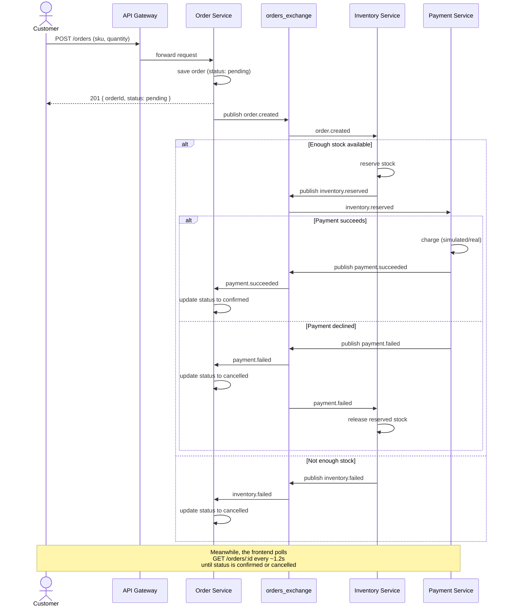

# Sequence Diagram — Checkout Flow

This traces exactly what happens, step by step, from a customer clicking
"Buy Now" to their order reaching a final state. It covers all three
possible outcomes: success, out-of-stock, and payment declined (with
rollback).

Cross-reference: every message name below matches an event defined in
[`docs/events/event-catalog.md`](../events/event-catalog.md) exactly. If you
ever see a mismatch between this diagram and that file while building, the
event catalog is the source of truth — update this diagram to match it, not
the other way around.

## Reading this diagram

- The **first three messages** (Customer → Gateway → Order Service, and the
  `201` response back) are the only *synchronous* part of this entire flow.
  The customer's browser gets an immediate response with `status: pending`
  — it does not wait around for stock or payment to resolve
- Everything below that happens **independently of the customer's original
  request** — Order Service already responded and moved on
- The two `alt` blocks show the three possible endings: confirmed, cancelled
  (out of stock), or cancelled (payment declined + stock released)
- Notice Inventory Service and Payment Service **never message each other
  directly** — every arrow between them passes through `orders_exchange`.
  This is the event-driven decoupling from
  [ADR 0002](../../adr/0002-use-event-driven-communication-with-rabbitmq.md)
  made visible in a real flow, not just an abstract idea
- The final note explains how the *customer* actually finds out the result:
  polling. We chose polling for the MVP because it's simple and good enough
  at this scale — a documented, deliberate tradeoff, not an oversight. If
  this becomes a real limitation later (e.g. wanting instant push updates),
  that would be a good candidate for its own future ADR about WebSockets or
  Server-Sent Events.

## What this diagram deliberately leaves out

- Retry logic if a message fails to deliver (RabbitMQ's delivery guarantees
  are a topic for the Observability/hardening phases, not system design)
- Idempotency handling (what if `order.created` gets delivered twice?) — a
  known real gap, intentionally deferred and tracked as a future
  improvement rather than solved here