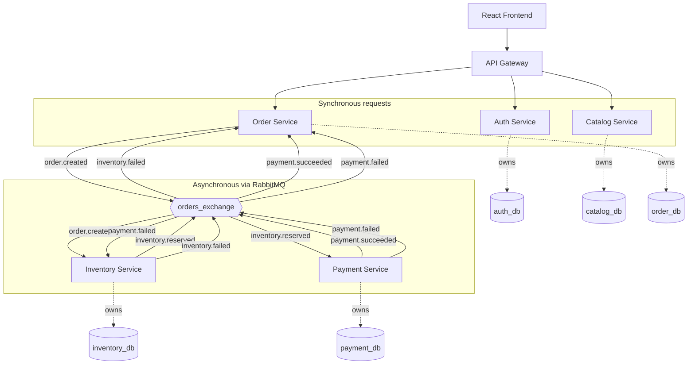

# System Architecture Overview

This document describes the MVP architecture: how the frontend, API Gateway,
and the five MVP-phase services (Auth, Catalog, Order, Inventory, Payment)
fit together. The remaining 13 services (see [README](../../README.md)) will
be added in the Expansion arc, following the same patterns established here.

## The two kinds of communication in this system

There are exactly two ways anything talks to anything else in StyleSphere,
and it's important to keep them mentally separate:

1. **Synchronous (solid lines below):** The frontend calls the API Gateway,
   and the Gateway routes the request to the right service. This is a normal
   request/response, like any REST API call. Used only for direct
   customer-facing actions (log in, browse products, place an order).

2. **Asynchronous, via events (dashed lines below):** Once an order is
   placed, everything that happens next — checking stock, charging a card,
   confirming or cancelling the order — happens through services publishing
   and reacting to **events** on RabbitMQ. No service calls another service's
   API for this part. See [`docs/events/event-catalog.md`](../events/event-catalog.md)
   for the exact events involved (added in the next piece of this phase).

## Diagram

## Reading the diagram

- **Solid arrows** = a direct request/response call
- **Dashed arrows** = "owns" — a database only that one service is allowed
  to touch (see [ADR 0003](../../adr/0003-database-per-service.md))
- Every arrow going into or out of `orders_exchange` is an **event**, not a
  direct call. Inventory Service has never heard of Payment Service, and
  vice versa — they only know about events

## Why the Gateway doesn't route to Inventory or Payment directly

Notice the Gateway only routes to Auth, Catalog, and Order — not Inventory or
Payment. That's intentional: customers never need to directly ask "reserve
this stock" or "charge this card." Those only ever happen as a *reaction* to
an order being placed. Keeping them out of the Gateway's routing table
enforces that they can only be triggered the correct way — through the event
flow, never bypassed.

## What happens when a customer places an order (summary)

1. Customer clicks "buy" → Gateway → Order Service → order saved as `pending`
2. Order Service publishes `order.created`
3. Inventory Service reacts: enough stock? reserve it. Not enough? fail it.
4. If reserved, Payment Service reacts: charge simulated/real payment
5. If payment fails, Inventory Service reacts again: release the stock
6. Order Service reacts to whichever final outcome event arrives, and
   updates the order to `confirmed` or `cancelled`

Full event payloads are documented in
[`docs/events/event-catalog.md`](../events/event-catalog.md). The full
step-by-step sequence diagram is in
[`docs/architecture/sequence-checkout-flow.md`](./sequence-checkout-flow.md).