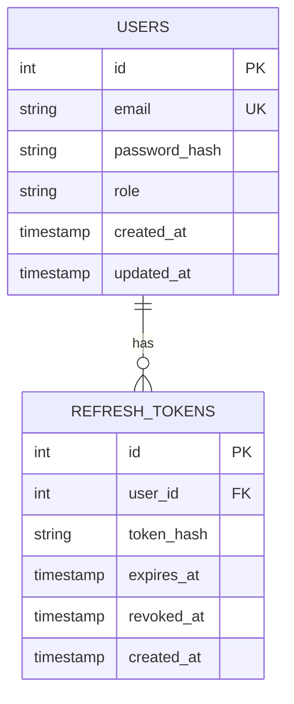
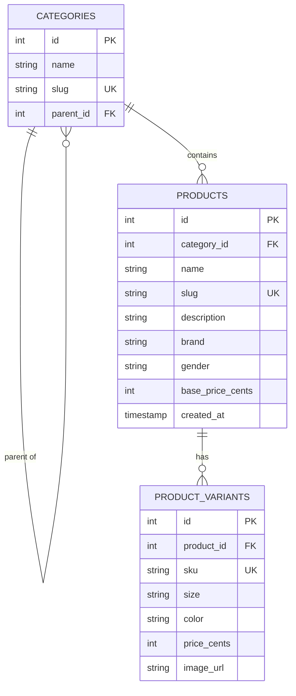
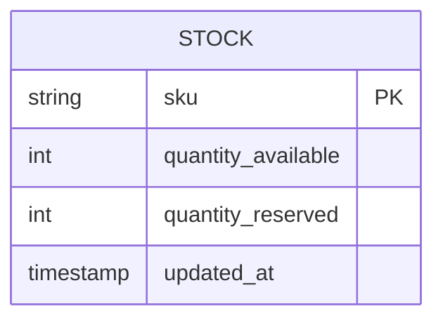
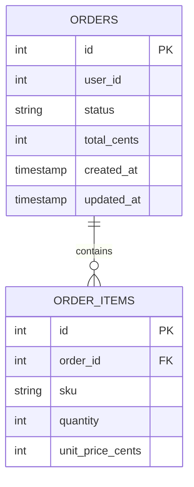
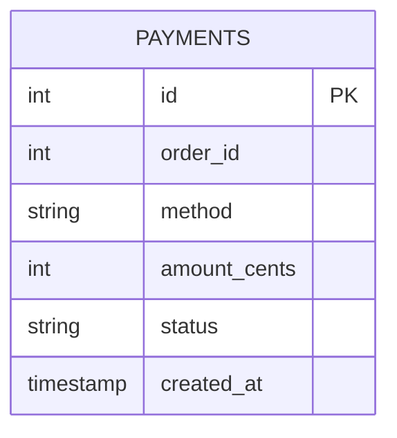

# Database Schema Overview — MVP Services

Each service below owns a completely separate PostgreSQL database (see
[ADR 0003](../../adr/0003-database-per-service.md)). There are no foreign
keys *between* services — only within a single service's own database.
Cross-service references (e.g. an order referencing a product SKU) are
stored as plain values, trusted at the time they were written, per
[ADR 0002](../../adr/0002-use-event-driven-communication-with-rabbitmq.md).

---

## `auth_db` — Auth Service



**`role`** is one of: `customer`, `admin`, `super_admin` (Guest isn't a
stored role — it just means "no valid token present," handled at the
Gateway).

**Why a separate `refresh_tokens` table instead of just a longer-lived JWT:**
storing refresh tokens lets us revoke one specific session (e.g. "log out
this device") by deleting or marking one row, without invalidating every
device the user is logged into. A pure stateless JWT can't do this — this is
the practical cost of the "gains vs. costs" tradeoff written in
[ADR 0004](../../adr/0004-jwt-based-authentication.md).

```sql
CREATE TABLE users (
    id SERIAL PRIMARY KEY,
    email TEXT UNIQUE NOT NULL,
    password_hash TEXT NOT NULL,
    role TEXT NOT NULL DEFAULT 'customer'
        CHECK (role IN ('customer', 'admin', 'super_admin')),
    created_at TIMESTAMP DEFAULT NOW(),
    updated_at TIMESTAMP DEFAULT NOW()
);

CREATE TABLE refresh_tokens (
    id SERIAL PRIMARY KEY,
    user_id INTEGER NOT NULL REFERENCES users(id),
    token_hash TEXT NOT NULL,
    expires_at TIMESTAMP NOT NULL,
    revoked_at TIMESTAMP,
    created_at TIMESTAMP DEFAULT NOW()
);
```

> Note: we store `token_hash`, never the raw refresh token — same principle
> as password hashing. If this table ever leaked, raw tokens couldn't be
> lifted straight out of it.

---

## `catalog_db` — Catalog Service



**Why `categories` references itself (`parent_id`):** this is how we model
your category tree — e.g. `Men → Tops → T-Shirts` — as one flexible table
instead of separate `main_categories` / `sub_categories` tables. A T-Shirts
row just has `parent_id` pointing at Tops's row, which points at Men's row.

**Why `price_cents` exists on both `products` (as `base_price_cents`) and
`product_variants`:** the product's price is a default/display price (e.g.
for the product grid). A specific variant can override it — e.g. size XXL
might cost more fabric and be priced higher. If a variant's `price_cents` is
null, the frontend/backend falls back to the product's `base_price_cents`.

```sql
CREATE TABLE categories (
    id SERIAL PRIMARY KEY,
    name TEXT NOT NULL,
    slug TEXT UNIQUE NOT NULL,
    parent_id INTEGER REFERENCES categories(id)
);

CREATE TABLE products (
    id SERIAL PRIMARY KEY,
    category_id INTEGER NOT NULL REFERENCES categories(id),
    name TEXT NOT NULL,
    slug TEXT UNIQUE NOT NULL,
    description TEXT,
    brand TEXT,
    gender TEXT CHECK (gender IN ('men', 'women', 'kids', 'unisex')),
    base_price_cents INTEGER NOT NULL,
    created_at TIMESTAMP DEFAULT NOW()
);

CREATE TABLE product_variants (
    id SERIAL PRIMARY KEY,
    product_id INTEGER NOT NULL REFERENCES products(id),
    sku TEXT UNIQUE NOT NULL,
    size TEXT,
    color TEXT,
    price_cents INTEGER,
    image_url TEXT
);
```

> Note: `sku` is what Order Service, Inventory Service, and Payment Service
> all reference by value — it's the one identifier that crosses service
> boundaries in this system.

---

## `inventory_db` — Inventory Service



Deliberately the simplest schema in the system. Inventory Service doesn't
need to know a SKU's size, color, or price — only "how many of this exact
SKU do we have."

**Why both `quantity_available` and `quantity_reserved` instead of just one
number:** this separation is what makes the reserve/rollback pattern from
[ADR 0002](../../adr/0002-use-event-driven-communication-with-rabbitmq.md)
auditable. When stock is reserved, we move units from `available` into
`reserved` — the total never silently changes, we can always see "10 total,
2 currently held for pending orders." If payment fails, those 2 move back to
`available`. (In the earlier prototype, we only tracked one number, which
worked but hid this detail — worth doing properly this time.)

```sql
CREATE TABLE stock (
    sku TEXT PRIMARY KEY,
    quantity_available INTEGER NOT NULL DEFAULT 0,
    quantity_reserved INTEGER NOT NULL DEFAULT 0,
    updated_at TIMESTAMP DEFAULT NOW()
);
```

---

## `order_db` — Order Service



**Why `order_items` is a separate table instead of one SKU/quantity per
order (like the earlier prototype):** a real checkout lets a customer buy
several different items in one order (a hoodie *and* a pair of jeans, in one
purchase). Designing this in now — even though the MVP loop only exercises
one item at a time — means Cart Service (built later, in Expansion) can
create multi-item orders without Order Service needing to change at all.

**Why `user_id` has no `REFERENCES users(id)`:** it looks like it should be
a foreign key, but `users` lives in `auth_db` — a completely different
database that `order_db` cannot see. This is the same cross-service
reference-by-value pattern as `sku`. `user_id` is nullable, to support guest
checkout.

```sql
CREATE TABLE orders (
    id SERIAL PRIMARY KEY,
    user_id INTEGER,
    status TEXT NOT NULL DEFAULT 'pending'
        CHECK (status IN ('pending', 'confirmed', 'cancelled')),
    total_cents INTEGER NOT NULL,
    created_at TIMESTAMP DEFAULT NOW(),
    updated_at TIMESTAMP DEFAULT NOW()
);

CREATE TABLE order_items (
    id SERIAL PRIMARY KEY,
    order_id INTEGER NOT NULL REFERENCES orders(id),
    sku TEXT NOT NULL,
    quantity INTEGER NOT NULL,
    unit_price_cents INTEGER NOT NULL
);
```

---

## `payment_db` — Payment Service



**`method`** is one of: `cod`, `easypaisa`, `jazzcash`, `card` — matching
the Pakistani payment methods from the project spec. Notice the schema
doesn't need to change at all to add a new method later (e.g. Stripe) — it's
just a new allowed value in this column, which is exactly the "pluggable
without changing Order Service" requirement from the original spec.

```sql
CREATE TABLE payments (
    id SERIAL PRIMARY KEY,
    order_id INTEGER NOT NULL,
    method TEXT NOT NULL
        CHECK (method IN ('cod', 'easypaisa', 'jazzcash', 'card')),
    amount_cents INTEGER NOT NULL,
    status TEXT NOT NULL DEFAULT 'pending'
        CHECK (status IN ('pending', 'charged', 'declined')),
    created_at TIMESTAMP DEFAULT NOW()
);
```

---

## Summary — what's intentionally deferred

A few things are visibly missing from these schemas on purpose, not by
oversight:

- **No `stock` breakdown by size/color beyond the SKU** — each size/color
  combination already has its own SKU (from `product_variants`), so
  Inventory Service doesn't need to know about size/color at all, only SKUs
- **No `cart` table anywhere** — Cart Service doesn't exist yet in the MVP;
  right now the frontend sends a direct "buy this SKU, this quantity"
  request straight to Order Service. Cart Service arrives in the Expansion
  arc and will sit *in front of* this same order-creation flow
- **No indexes defined yet** — we'll add indexes (e.g. on `order_items.sku`,
  `products.category_id`) once we have real query patterns from building the
  actual services, instead of guessing now